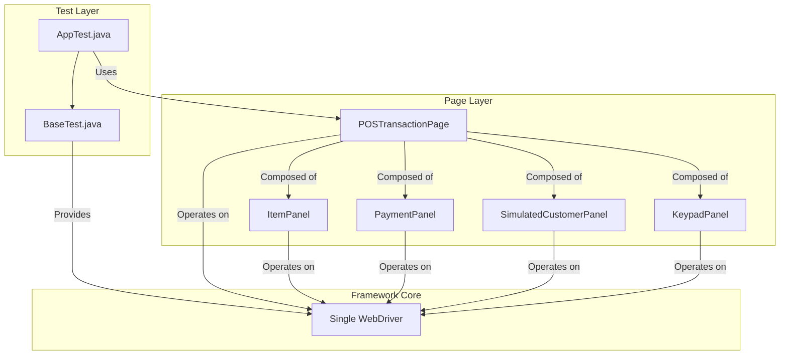

# UI Automation Project

This project is a sample UI automation framework using Java, Selenium WebDriver, TestNG, and ExtentReports.

## Project Structure

```
ui-automation/
├── pom.xml
├── src/
│   ├── main/
│   │   └── java/
│   │       └── com/ui/automation/
│   │           (empty)
│   └── test/
│       ├── java/
│       │   └── com/ui/automation/
│       │       ├── Base/
│       │       │   └── BaseTest.java
│       │       ├── Tests/
│       │       │   └── AppTest.java
│       │       ├── Utilities/
│       │       │   ├── DriverFactory.java
│       │       │   ├── ExtentReportManager.java
│       │       │   ├── RetryAnalyzer.java
│       │       │   ├── ScreenshotUtil.java
│       │       │   └── TestNGListener.java
│       │       └── pages/
│       │           ├── POSTransactionPage.java
│       │           └── components/
│       │               ├── ItemPanel.java
│       │               ├── KeypadPanel.java
│       │               ├── PaymentPanel.java
│       │               └── SimulatedCustomerPanel.java
│       └── resources/
├── testng.xml
└── test-output/
```

## Key Features
- **Selenium WebDriver** for browser automation
- **TestNG** for test orchestration and reporting
- **ExtentReports** for rich HTML reports with screenshots
- **Automatic screenshot capture on test failure** (via `TestNGListener`)
- **Manual screenshot capture at any test step** (via `ScreenshotUtil`)
- **Retry logic** for flaky tests (`RetryAnalyzer`)
- **Efficient session & login management** (see below)

## Framework Architecture (Component-Based POM)

This framework uses a component-based Page Object Model (POM) to manage the complexity of the Point of Sale (POS) simulator. Even though the test application is a single page, it is divided into distinct functional areas, each managed by its own "component" class.



### How it Works
- **`POSTransactionPage.java`**: Acts as the main entry point for the page. It does not contain any locators or methods for interaction itself. Instead, it initializes and provides access to all the component panels.
- **Component Panels** (e.g., `ItemPanel`, `PaymentPanel`): Each component class is responsible for a specific area of the application. It contains the Selenium locators and methods for interacting with the elements within that area (e.g., `scanItemWithButton()`, `clickProcessPayment()`).
- **Tests** (`AppTest.java`): Test cases are clean and readable. They orchestrate the test flow by calling methods from the different component panels via the main `POSTransactionPage`.

This approach makes the framework highly organized, scalable, and easy to maintain.

## Test Session & Login Management
- **Login and browser session are initialized only once per test class.**
- All tests within the same test class share the same browser session and remain logged in.
- When a new test class starts, a new browser session and login are performed.
- This design makes tests faster and avoids repeated logins for every test method.

## How to Run Tests

1. **Install dependencies:**
   - Make sure you have Java and Maven installed.
   - Run `mvn clean install` to download dependencies and build the project.

2. **Run tests:**
   - Execute `mvn test` or run tests via your IDE.
   - Test results and reports will be generated in the `test-output/` directory.

3. **View Reports:**
   - Open `test-output/ExtentReport.html` in your browser to view the test report with screenshots.

## Screenshot & Reporting Utilities
- **Automatic Failure Screenshots:**
  - On any test failure, a screenshot is captured and attached to the report automatically by the `TestNGListener`.
- **Manual Step Screenshots:**
  - Call `ScreenshotUtil.captureAndAttachScreenshot("Step description")` in your test to capture and attach a screenshot at any point.
- **See `ScreenshotUtil.java` for more details on usage and design.**

## Customization
- Update `DriverFactory` to use different browsers or capabilities as needed.
- Modify `testng.xml` to configure test suites and listeners.

## License
This project is for demonstration and educational purposes. 